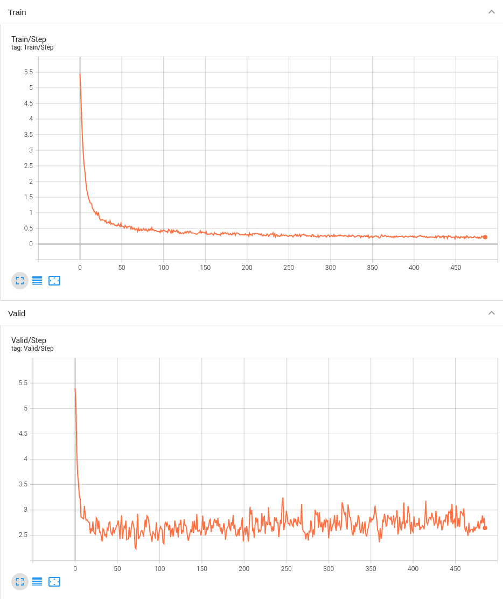

# 2022 AI CUP: Orchid Species Recognition

https://tbrain.trendmicro.com.tw/Competitions/Details/20

## Version 1: Use GoogleNet

### Problems

In `main.py`, we use self-defined dataset class to construct our dataset, and use `random_split` to split our dataset into training dataset and validation dataset.

Reference: https://stackoverflow.com/questions/65231299/load-csv-and-image-dataset-in-pytorch

However, <font color=#FF0000>**all of the dataset apply `train_tfm` transform method, which is NOT CORRECT in validation set.**</font> This is a critical dataset problem.

### Result

The result of splitting ratio = 0.7, i.e., 7 pictures for training and 3 pictures for validation, is shown below.

```
[ Train | 073/10000 ] loss = 0.44498, acc = 0.87742
[ Valid | 073/10000 ] loss = 2.23616, acc = 0.54436
Saving model with validation loss 2.23616 and accuracy 0.54436
```



